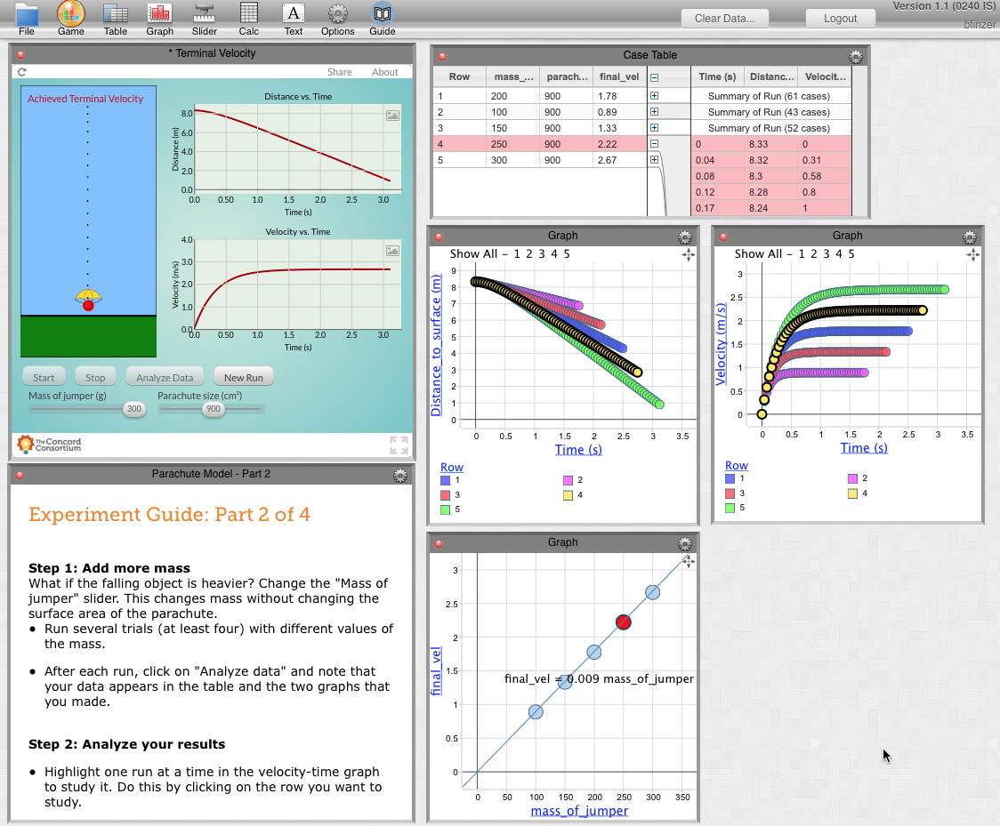

CODAP
=====
Common Online Data Analysis Platform
------------------------------------
### A Bit of History

Development of this codebase began in 2010 as part of the work of KCP Technologies' NSF-supported [Data Games](http://play.ccssgames.com/) project. In a data game, the data generated by the playing the game flows into CODAP for analysis and visualization. In a well-designed data game, the player cannot progress very far without using the data to inform and refine a strategy.

Starting in 2012 CODAP became the data analysis environment for Concord Consortium's NSF-supported [InquirySpace](http://concord.org/projects/inquiryspace) project. Developed to promote scientific inquiry in high school science classes, students work with simulations or gather data with probes. The data flow into CODAP for analysis, facilitating hypothesis generation and iteration of experiments.

In April, 2014, CODAP (project web site being developed) received NSF funding as a project in its own right with the goal of developing a platform that can be used by developers of online curriculum materials that engage learners with data. Initial collaborations are: continuing work with InquirySpace and new work with [OceanTracks](http://oceantracks.org) at [EDC](http://www.edc.org) and [Terra Populus](http://www.terrapop.org) at the [Minnesota Population Center](https://www.pop.umn.edu/index.php). CODAP's success depends on the extent to which a community of developers embraces it as a way to bring dynamic, interactive data science tools to classroom (and other) learning.

### What CODAP Looks Like

What CODAP looks like will depend strongly on the context. But below is a screen shot of CODAP in use with an InquirySpace investigation. The **Terminal Velocity** component is a simulation that is streaming data to CODAP. Note the hierarchical structure of the data in which there are five runs, each containing a time series. Note also the linked selection in which the fourth run and its time series are selected.

### The License

CODAP software is provided here under an open-source Apache 2.0 license.
For details on this license, please see the LICENSE file included with this repository
or the [Apache License, Version 2.0](http://www.apache.org/licenses/LICENSE-2.0.html).

---

## Developing with the CODAP Open Source Repository ##

## Setting Up the Development Environment ##

### Development Pre-requisites ###

#### Ruby 1.9.2+ ####

SproutCore requires Ruby 1.9.2+ for its build tools. Mac OS X versions up to 10.8 shipped with Ruby 1.8.7. (OS X version 10.9 apparently includes Ruby 2.0.) The easiest way to install newer Ruby versions is to use rvm, the Ruby Version Manager. Using rvm to install Ruby, in turn, requires the presence of Xcode and its command line tools on Mac OS X. Thus, upgrading to Ruby 1.9.2+ may require the following:

  * [Mac OS X] Make sure that Xcode and its command line tools are installed
    * Xcode 3 installs command line tools by default
    * Xcode 4+ require a separate install of the command line tools
  * [Install rvm](https://rvm.io/rvm/install)
  * Use rvm to install Ruby 1.9.3

<pre><code>$ rvm install 1.9.3</code></pre>

#### SproutCore 1.9.2 ####

    $ gem install sproutcore -v 1.9.2

## Get the CODAP Source ##

To clone the CODAP repository itself:

    $ git clone https://github.com/kcpt/codap.git
    $ cd codap
    $ git submodule update --init --recursive

To work with the CODAP repository it is often useful to fork it on Github and then clone the fork.

## Run the CODAP Application Locally ##

    $ sc-server

This runs the [SproutCore server](http://guides.sproutcore.com/build_tools.html#developing-with-sproutcore-sproutcore-server), which serves the application code locally. To run the application, enter the following URL into your web browser of choice: [http://localhost:4020/dg](http://localhost:4020/dg).

This should run the CODAP application and bring up the login dialog.

## Configure CODAP Login ##

By default, the CODAP application proxies to http://dg.ccssgames.com. Guest access is available, but a user account is required to be able to save and restore documents. It's free to [create a user account](http://play.ccssgames.com/user/register), if desired.

## Modifying the CODAP Source ##

Most changes to the CODAP application source are automatically reflected by simply reloading the browser page at [http://localhost:4020/dg](http://localhost:4020/dg). More extensive changes (e.g. adding/removing source files) may require stopping and restarting **sc-server** and/or removing the generated **tmp** folder.
