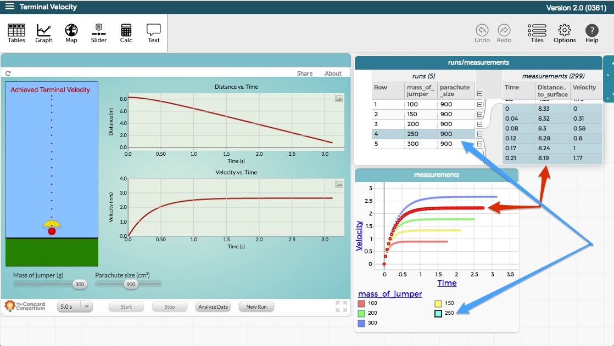

CODAP
=====
Common Online Data Analysis Platform
------------------------------------
### A Bit of History

Development of this codebase began in 2010 as part of the work of KCP Technologies' NSF-supported [Data Games](http://play.ccssgames.com/) project. In a data game, the data generated by playing the game flows into CODAP for analysis and visualization. In a well-designed data game, the player cannot progress very far without using the data to inform and refine a strategy.

Starting in 2012 CODAP became the data analysis environment for [Concord Consortium](https://concord.org/)'s NSF-supported [InquirySpace](http://concord.org/projects/inquiryspace) project. Developed to promote scientific inquiry in high school science classes, students work with simulations or gather data with probes. The data flow into CODAP for analysis, facilitating hypothesis generation and iteration of experiments.

In April, 2014, CODAP received NSF funding as a [project in its own right](https://concord.org/projects/codap) with the goal of developing a platform that can be used by developers of online curriculum materials that engage learners with data. Initial collaborations are: continuing work with InquirySpace and new work with [OceanTracks](http://oceantracks.org) at [EDC](http://www.edc.org) and [Terra Populus](http://www.terrapop.org) at the [Minnesota Population Center](https://www.pop.umn.edu/index.php). CODAP's success depends on the extent to which a community of developers embraces it as a way to bring dynamic, interactive data science tools to classroom (and other) learning.

### What CODAP Looks Like

What CODAP looks like will depend strongly on the context. But below is a screen shot of CODAP in use with an InquirySpace investigation. The **Terminal Velocity** component is a simulation that is streaming data to CODAP. Note the hierarchical structure of the data in which there are five runs, each containing a time series. Note also the linked selection in which the fourth run and its time series are selected.

### The License

CODAP software is provided here under an open-source MIT license.
For details on this license, please see the LICENSE file included with this repository
or [The MIT License (MIT)](https://opensource.org/licenses/MIT). CODAP was initially released under the Apache 2.0 license, and so you may see references to that license in the sources as well.

---

## More Information
If you are interested in contributing to **CODAP web app development**, follow the [CODAP Developer Guide](https://github.com/concord-consortium/codap/wiki/Developer-Guide).

If you are interested in creating a **data interactive** to be used in CODAP, follow the [CODAP Data Interactive API Guide](https://github.com/concord-consortium/codap/wiki/CODAP-Data-Interactive-API).

* [CODAP Product Site](http://codap.concord.org/)
* [CODAP Project Site](https://concord.org/projects/codap/)
* [CODAP Data Interactive API Guide](https://github.com/concord-consortium/codap/wiki/CODAP-Data-Interactive-API): 
An API that permits Data Interactives to exchange case data and context information with their CODAP host.
* [CODAP Developer Guide](https://github.com/concord-consortium/codap/wiki/Developer-Guide):
How to install and run a development environment to modify CODAP platform-level software.
* [CODAP Release Notes](https://github.com/concord-consortium/codap/wiki/Release-Notes)
* [CODAP Game API](https://github.com/concord-consortium/codap/wiki/CODAP-Game-API) (Deprecated):
An API that permits Data Interactives to forward case data to their CODAP host.
* [CODAP Game API Tutorial](https://github.com/concord-consortium/codap/wiki/CODAP-Game-API-Tutorial) (Deprecated):
How to write a simple CODAP Data Interactive using a Game API helper class.

You can also check out the [CODAP Forum](https://groups.google.com/a/concord.org/forum/#!forum/codap) for questions and discussions on the use of CODAP.

For help, send email to <codap-help@concord.org>

## Translations

The Chinese translation was contributed by Dr. Silvia Wen-Yu Lee’s research team 
at National Changhua University of Education.

繁體中文部分由國立彰化師範大學李文瑜博士研究團隊翻譯完成

Translation hosting services graciously provided by [POEditor](https://poeditor.com).

Many thanks.